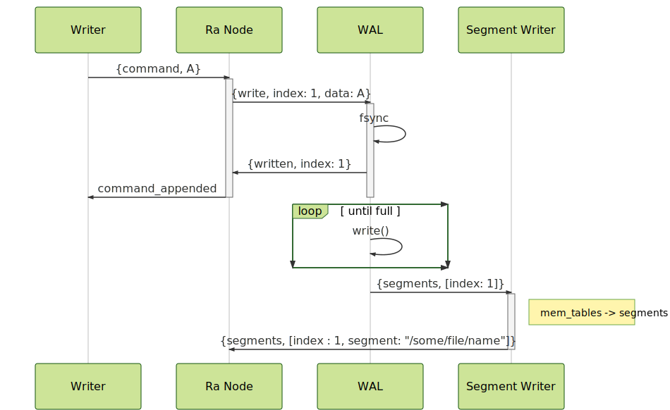

# Ra Log Implementation

Ra is designed to support potentially thousands of Ra nodes per erlang node.
As all data needs to be safely persisted and fsync-ed to disk before it can be
actioned it is not practical or performant to have each node write log entries
to their own log files. Ra's log design instead is optimised to avoid
parallel calls to `fsync(1)` and thus need to funnel all log entry writes
through a common file, named the write ahead log
(although strictly speaking there is
no "ahead" in this sense).

All messages are sent asynchronously to maximise throughput with ARQ like
protocols where needed.

There are several processes involved in the Ra log implementation:

#### The Ra Node

The Ra node initiates all write operations and coordinates all notifications
received from the other processes. It is the only process that reads from
the log. Typically most reads are done from in memory ETS tables but it may
occasionally read from log segments on disk, particularly when recovering
after a restart.

#### The Write Ahead Log (WAL):

This is the process where all writes initially go to.
The WAL appends entries from all
Ra nodes running on the current erlang node to a single file and calls `fsync(1)`
after a certain number of writes have been performed _or_ there are no further
write operations pending in it's mailbox.
After each batch it notifies each Ra node that had a write in
that batch so that it can consider the entry written.

The WAL writes each entry to a per-Ra-node ETS table (a "mem table") which
the Ra node uses to read data from it's log.

The WAL tries to soak up load by dynamically increasing the max number of
writes per batch, trading latency for throughput.

Depending on the system a call to `fsync(1)` can block for several milliseconds.
Typically the size of a WAL batch is tuned to the number of messages received
during the `fsync(1)` call. The WAL then quickly writes all pending entries to
disk, calls `fsync(1)` which will accumulate further writes and so on.

#### The Segment Writer

To avoid perpetually appending to and ever growing file the WAL periodically
"rolls over" to a new file. The old file and the mem tables written during
the lifetime of that file are passed to the segment writer process that is
responsible for flusing the mem tables to per-ra-node specific on disk
storage. The data is stored in variably sized segments with a fixed number of
of log entries.

When the segment writer has finished flushing all the mem tables for all the
Ra nodes that wrote to the WAL file it deletes the WAL file.

#### The Snapshot Writer

Ra nodes offload the work of persisting snapshots to the snapshot writer
process to that a large snapshot write does not block the Ra node
unnecessarily. After a Ra node has written a snapshot it can delete any
segments that only contain entries with a lower index than the snapshot.

## Write interaction overview

A simplified view of the lifetime of a single write.

