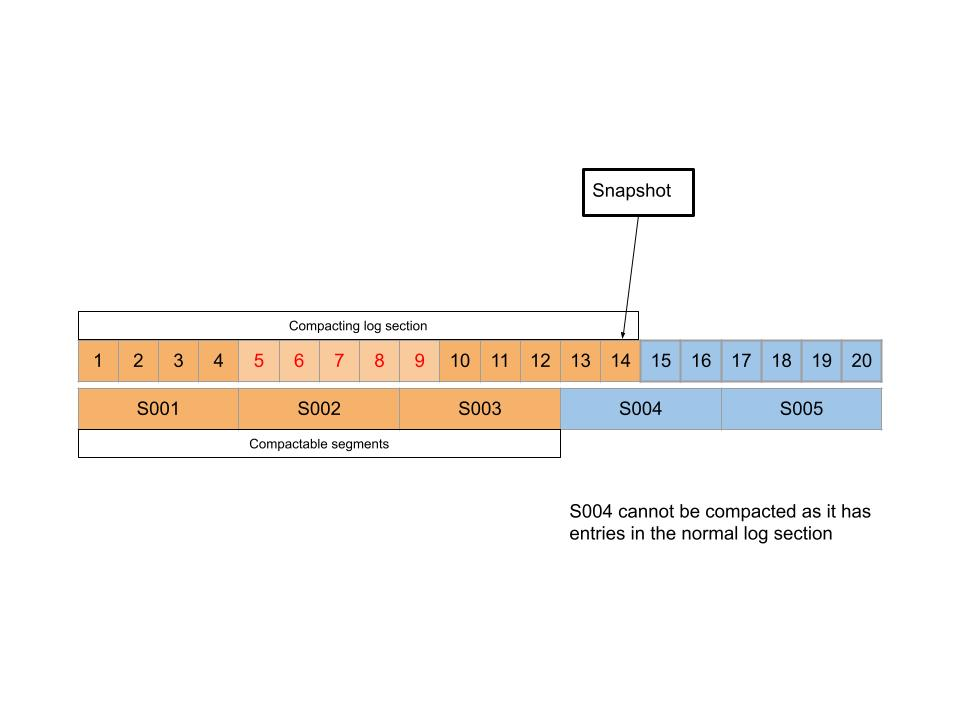
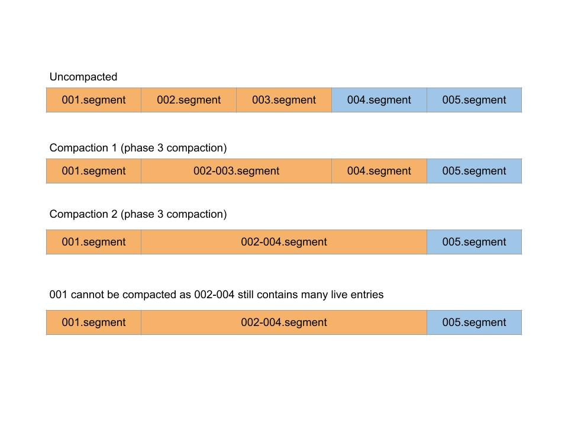
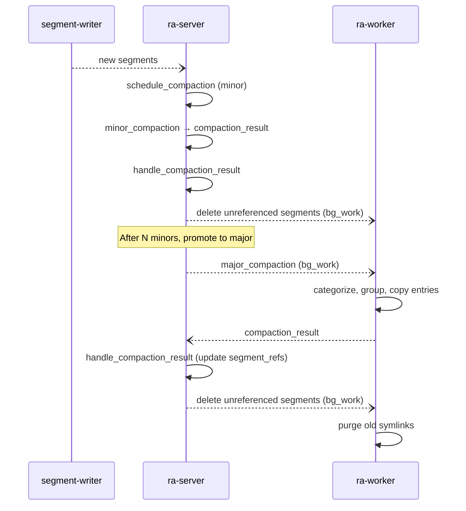

# Ra log compaction

This document describes the log compaction feature in Ra v3.

## Overview

Compaction in Ra is intrinsically linked to the snapshotting feature. Standard 
Raft snapshotting removes all entries in the Ra log below the snapshot index
that are not explicitly required by the state machine.

The high level idea of compacting in Ra is that instead of deleting all segment 
data that precedes the snapshot index, the state machine can emit a list of 
**live raft indexes** which will be kept, either in their original segments or 
written to new compacted segments. The data for these indexes can then be 
omitted from the snapshot to reduce its size and the write amplification 
incurred by writing the snapshot.

For example the `ra_kv` key-value store only keeps a map of Key => Raft Index in memory and reads the values from disk on demand when reading. 

### Machine Callback

State machines can implement the optional `live_indexes/1` callback to return
a list of log indexes that should be retained beyond the snapshot boundary:

```erlang
-callback live_indexes(state()) -> [ra:index()].
```

Returning an empty list `[]` results in standard Raft log truncation behaviour.

### Log sections

Two named sections of the log emerge:

#### Normal log section

The normal log section is the contiguous log that follows the last snapshot.

#### Compacting log section

The compacting log section consists of all live raft indexes that are lower
than or equal to the last snapshot taken.




## Compaction phases

### Minor compaction (Phase 1)

Minor compaction identifies and deletes whole segments that contain no live 
entries. This is the simplest and most efficient form of compaction.

**When it runs**: After each snapshot is taken.

**How it works**:
1. Get all "compactable" segment refs (segments with end index ≤ snapshot index,
   excluding the current/active segment)
2. For each segment, check if any of its indexes are in the live indexes list
   using `ra_seq:in_range/2`
3. Segments with zero live indexes are marked as "unreferenced" and deleted

Minor compaction runs synchronously in the Ra server process as it only 
involves checking ranges and deleting files - no data copying.

**Special case**: If `LiveIndexes == []` (standard Raft behaviour), ALL 
compactable segments are deleted immediately without checking ranges.

### Phase 2

Not implemented. This is a space holder phase that could truncate and/or punch
holes in existing segments for data that is no longer referenced.

### Major compaction (Phase 3)

Major compaction consolidates multiple segments by copying only the live entries
into new, smaller segments. This runs in the background `ra_worker` process.

**When it runs**: 
- Automatically after N minor compactions (configurable via `{num_minors, N}`)
- Manually via `ra:trigger_compaction/1`

**How it works**:

1. **Categorize segments**: For each compactable segment ref:
   - If `ra_seq:in_range(SegmentRange, LiveIndexes)` returns `[]` → mark for 
     deletion (no live entries)
   - Otherwise → candidate for compaction (has some live entries)

2. **Clean up orphaned files**: Delete any `.segment` files on disk that exist 
   but are not in the current segment refs list (handles overwritten segments)

3. **Form compaction groups**: Group adjacent compaction candidates (see below)

4. **Process each group**: For each compaction group:
   - Create a new `.compacting` segment
   - Copy live entries from all source segments using `ra_log_segment:copy/3`
   - Create symlinks for additional segments pointing to the first
   - Rename `.compacting` to replace the first segment
   - Delete the compaction marker

5. **Return result**: Three categories of segments:
   - `unreferenced`: Segments with no live entries (to be deleted)
   - `linked`: Additional segments in compaction groups (now symlinks)
   - `compacted`: New segment refs for the compacted segments

#### Compaction groups

A **compaction group** is a set of adjacent segments whose live entries will be 
merged into a single new segment.

**Formation algorithm** (`take_group/3`):

Starting from the oldest compactable segment and moving forward:

1. **Check compaction benefit**: A segment is only added to a group if:
   - `NumLiveEntries / TotalEntries < 0.5` (less than 50% live entries), OR
   - `LiveDataSize / TotalDataSize < 0.5` (less than 50% live data)

2. **Check size limits**: Adding the segment must not exceed:
   - `max_count`: Maximum number of live entries in the resulting segment
   - `max_size`: Maximum size in bytes of live data

3. **Handle dense segments** (≥50% live entries AND ≥50% live data):
   - If the group is empty → skip this segment, continue to next
   - If the group has entries → finalize this group, start fresh with next segment

**Example**:

```
Segments to evaluate (oldest to newest):
  Seg1: 1000 entries, 200 live (20%) → Add to Group A
  Seg2: 1000 entries, 300 live (30%) → Add to Group A (if fits in max_count/max_size)
  Seg3: 1000 entries, 800 live (80%) → Dense! Finalize Group A, skip Seg3
  Seg4: 1000 entries, 100 live (10%) → Start Group B
  Seg5: 1000 entries, 150 live (15%) → Add to Group B

Result: 
  Group A: [Seg1, Seg2] → merged into new segment at Seg1's position
  Group B: [Seg4, Seg5] → merged into new segment at Seg4's position
  Seg3: unchanged (too dense to benefit from compaction)
```

#### Compaction file naming and recovery

**File naming**:
- Compacting segment: `<first_segment_name>.compacting` (e.g., `00000001.compacting`)
- Compaction marker: `<first_segment_name>.compaction_group` (e.g., `00000001.compaction_group`)
- The marker file contains: `term_to_binary([Seg1Fn, Seg2Fn, Seg3Fn, ...])`

**Compaction sequence**:
1. Write marker file with list of all segment filenames in the group
2. Create `.compacting` segment and copy all live entries
3. Close and sync the `.compacting` segment
4. Rename `.compacting` to replace the first segment (atomic on POSIX)
5. Create symlinks: for each additional segment (Seg2, Seg3, ...), create a 
   symlink pointing to the first segment's filename
6. Delete the marker file

**Why rename before symlinks**: This order ensures that when any symlink is 
created, it points to a segment that already contains the compacted data. 
If symlinks were created first, a reader following the symlink could see 
stale data from the old segment before the rename completes.

**Recovery after crash**:
- **No marker file**: No pending compaction
- **Marker with single segment**: Cannot determine completion state → delete 
  `.compacting` and marker, leave original intact
- **Marker with multiple segments, `.compacting` exists**: Rename didn't 
  complete → delete `.compacting` and marker, leave originals intact
- **Marker with multiple segments, `.compacting` absent**: Rename completed,
  compacted data is in place → recreate all symlinks (idempotent), delete marker

**Symlink cleanup**: Symlinks are deleted after 60 seconds (configurable via 
`?SYMLINK_KEEPFOR_S`). This delay ensures any in-flight reads referencing the 
old segment names can complete.

#### Triggering major compaction

Configuration via `major_strategy`:

```erlang
#{major_strategy => {num_minors, 5}}  %% trigger major after 5 minor compactions
#{major_strategy => manual}           %% only manual triggering via ra:trigger_compaction/1
```



### Phase 4 compaction (optional, not implemented)

At some point the number of live indexes could become completely sparse (no
adjacent indexes) and large which is sub-optimal memory wise.

At this point the state machine could implement a "rewrite" command to rewrite 
a subset or all of the indexes at the head of the Ra log to "clump" their 
indexes better together.

This is optional and has replication costs but could be a manually triggered
maintenance option.

## Architecture

### Ra Worker process

Each Ra server has an associated `ra_worker` process responsible for:

* Writing snapshots and checkpoints (in background)
* Performing major compaction runs
* Deleting old segment files
* Other background I/O work

The worker is started as part of the Ra server supervision tree and receives
work via the `{bg_work, FunOrMfa, ErrFun}` effect.



### Compaction result handling

The `#compaction_result{}` record contains:

```erlang
-record(compaction_result,
        {unreferenced = [] :: [file:filename_all()],  %% segments to delete
         linked = [] :: [file:filename_all()],        %% segments now symlinks
         compacted = [] :: [segment_ref()]}).         %% new segment refs
```

When `handle_compaction_result/2` processes this:
1. Remove `unreferenced` and `linked` segments from the segment refs
2. Add `compacted` segments to the segment refs
3. Evict all open segments from the cache (they may have changed)
4. Schedule background deletion of `unreferenced` files

### Impact on segment writer process

The segment writer process and WAL use the `ra_log_snapshot_state` ETS table
to avoid writing data that is no longer needed.

**Table structure** (4-tuple):
```erlang
{UId, SnapshotIndex, SmallestLiveIndex, LiveIndexes}
```

- `SnapshotIndex`: The index of the last completed snapshot (-1 if none)
- `SmallestLiveIndex`: The minimum of (SnapshotIndex + 1) and the first live index
- `LiveIndexes`: The `ra_seq:state()` of live indexes

The segment writer queries `smallest/2` to determine the floor for flushing
entries from the WAL to segments.

### Snapshot replication

With the snapshot now defined as the snapshot state + live preceding raft indexes,
snapshot replication includes a "pre" phase for live entries.

#### Snapshot install procedure

1. **Negotiation**: Sender determines which live indexes the receiver needs based
   on the receiver's `last_applied` index
2. **Pre phase**: Live indexes are sent before the snapshot data using sparse writes
3. **Snapshot phase**: Standard chunk-based snapshot replication

The receiving Ra process writes sparse entries to the WAL using a special mode
that:
* Bypasses contiguous gap detection
* Includes the previous index for sparse sequence gap detection
* Stores entries in a new memtable using `ra_mt:insert_sparse/3`

#### Determining needed live indexes

The follower needs all live indexes greater than its `last_applied` index.
This ensures live indexes are not stale entries.

Example:
- Incoming snapshot at index 2000, term 3
- Live indexes: `[100, 600, 1200, 1777]`
- If follower `last_applied` is 1500: follower needs `[1777]` only
- If follower `last_applied` is 1100: follower needs `[1200, 1777]`

### Live indexes storage

Live indexes are stored in a file named `indexes` in the snapshot directory,
written using `ra_snapshot:write_indexes/2`:

```erlang
write_indexes(Dir, Indexes) ->
    File = filename:join(Dir, <<"indexes">>),
    ra_lib:write_file(File, term_to_binary(Indexes)).
```

On snapshot recovery, `ra_snapshot:indexes/1` reads this file to restore the
live indexes sequence.

The `ra_seq` module provides an efficient data structure for representing
sparse sequences of indexes, compacting adjacent indexes into ranges:

```erlang
%% Example: [100, 101, 102, 500, 501, 600]
%% Stored as: [600, {500, 501}, {100, 102}]  (high to low, ranges compacted)
```

### WAL impact

The WAL uses `ra_log_snapshot_state:smallest/2` to avoid writing entries that 
are lower than a server's smallest live index. This optimisation helps the WAL
catch up when running with a longer mailbox backlog.

The WAL now:
* Accepts sparse writes via `ra_log_wal:write/7` with explicit `PrevIndex`
* Tracks sparse sequences in memory tables via `ra_mt` using `ra_seq:state()`
* Sends `ra_seq` of written entries to segment writer (not just ranges)
