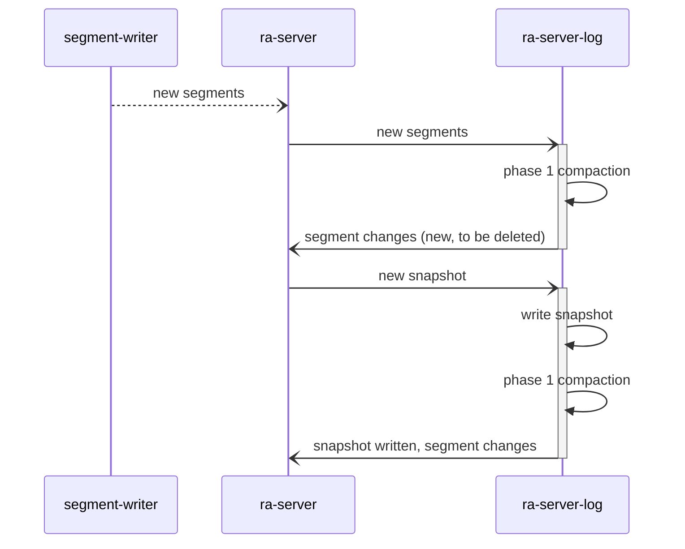

# Ra log compaction

This is a living document capturing current work on log compaction.

## Overview

Compaction in Ra is intrinsically linked to the snapshotting
feature. Standard Raft snapshotting removes all entries in the Ra log
below the snapshot index where the snapshot is a full representation of
the state machine state.

The high level idea of compacting in Ra is that instead of deleting all
segment data that precedes the snapshot index the snapshot data can emit a list
of live raft indexes which will be kept, either in their original segments
or written to new compacted segments. The data for these indexes can then
be omitted from the snapshot to reduce its size and the write amplification
incurred by writing the snapshot.

### Log sections

Two named sections of the log then emerge:

#### Normal log section

The normal log section is the contiguous log that follows the last snapshot.

#### Compacting log section

The compacting log section consists of all live raft indexes that are lower
than or equal to the last snapshot taken.

## Compaction phases

### Phase 1

Delete whole segments. This is the easiest and most efficient form of "compaction"
and will run immediately after each snapshot is taken.

The run will start with the oldest segment and move towards the newest segment
in the compacting log section. Every segment that has no entries in the live
indexes list returned by the snapshot state will be deleted. Standard Raft
log truncation is achieved by returning an empty list of live indexes.

TODO: how to ensure segments containing overwritten entries only are cleaned
up.

### Compacted segments: naming (phase 3 compaction)

Segment files in a Ra log have numeric names incremented as they are written.
This is essential as the order is required to ensure log integrity.

Desired Properties of phase 3:

* Retain immutability, entries will never be deleted from a segment. Instead they
will be written to a new segment.
* lexicographic sorting of file names needs to be consistent with order of writes
* Compaction walks from the old segment to new
* Easy to recover after unclean shutdown

Segments will be compacted when 2 or more adjacent segments fit into a single
segment.

During compaction the target segment will have the naming format `001-002-003.compacting`
such that each segment (001, 002, 003) name is present in the compacting name.
An upper limit on the maximum number of source segments will have to be set to
ensure the compacting file name doesn't get ridiculously long. E.g. 8.

Once the compacting segment has been synced the lowest numbered segment will
be hard linked to the compacting segment. Each of the compacted
higher numbered segments (003, 004) will then have a symlink created (e.g. 003.link)
pointing to the lowest numbered segment (002)
then the link is renamed to the source file: `003.link -> 003` (NB not atomic).

`001-002-003.compacting` is then deleted (but 002 is still hard linked so the data
will remain).

This naming format means it is easy to identify partially compacted segments
after an unclean exit. All `*.compacting` files with a link count of 1 will
be deleted as it is not clear at what stage the unclean exit occurred.

If a compacting file has a link count of 2 (or more???) the compacting writes
completed and the lowest numbered segment was hard linked to the compacting
segment. We don't know if all symlinks were created correctly so we need to ensure
this during recovery.

Once we've ensured there are hard or symlinks for all the source files the compacting
file can be deleted.

The symlinks are there so that any pending read references to the old
segment name are still valid for some time after but the disk space for the
source segment will still be reclaimed when the links replace the files.

Some time later the symbolic links can be removed.

Single segment compaction would work the same as we can directly rename
e.g. the compacted segment `001.compacting` to `001.segment` without breaking
any references to the segment. Single segment compaction should only be triggered
when a certain limit has been reached, e.g. > 50% of indexes can be cleared up.

TODO: how to handle compaction of segments that have indexes that never were
committed, i.e. overwritten?

#### When does phase 3 compaction run?

Options:

* On a timer
* After phase 1 if needed based on a ratio of live to dead indexes in the compacting section
* After phase 1 if needed based on disk use / ratio of live data to dead.
* Explicitly through a new ra API.

### Phase 4 compaction (optional)

At some point the number of live indexes could become completely sparse (no
adjacent indexes) and large which is sub optimal memory wise.

At this point the state machine could implement a "rewrite" command (or we
provide one in Ra) to rewrite a subset or all of the indexes at the head of
the Ra log to "clump" their indexes better together.

This is ofc optional and has replication costs but could be a manually triggered
maintenance option perhaps.

### Ra Server log worker responsibilities

* Write checkpoints and snapshots
* Perform compaction runs
* Report segments to be deleted back to the ra server (NB: the worker does
not perform the segment deletion itself, it needs to report changes back to the
ra server first). The ra server log worker maintains its own list of segments
to avoid double processing

#### Impact on segment writer process

The segment writer process as well as the WAL relies heavily on the 
`ra_log_snapshot_state` table to avoid writing data that is no longer 
needed. This table contains the latest snapshot index for every 
ra server in the system. In order to do the same for a compacting state machine
the segment writer would need access to the list of live indexes when flushing
the WAL to segments.

Options:

* It could read the latest snapshot to find out the live indexes
* Live indexes are stored in the `ra_log_snapshot_state` table for easy access.

Snapshots can be taken ahead of the segment part of the log meaning that the
segment writer and log worker may modify the log at different times. To allow
this there needs to be an invariant that the log worker never marks the last
segment for deletion as it may have been appended to after or concurrently
to when the log worker evaluated it's state.

The segment writer can query the `ra_log_snapshot_table` to see if the server
is using compaction (i.e. have preceding live entries) and if so read the
live indexes from the snapshot directory (however it is stored). Then it
can proceed writing any live indexes in the compacting section as well as
contiguous entries in the normal log section.

Segment range: (1, 1000)

Memtable range: (1001, 2000)

Snapshot: 1500, live indexes `[1501, 1999]`,

Alt: if the log worker / Ra server is alive the segment writer could call into
the log worker and ask it to do the log flush and thus make easy use of the
live indexes list. If the Ra server is not running but is still registered
the segment writer will flush all entries (if compacting), even those preceding 
last snapshot index. This option minimises changes to segment writer but could
delay flush _if_ log worker is busy (doing compaction perhaps) when
the flush request comes in.

### Snapshot replication

With the snapshot now defined as the snapshot state + live preceding raft indexes
the default snapshot replication approach will need to change.

The snapshot sender process (currently transient) first sends all live
entries for the given snapshot, then performs normal chunk based
snapshot replication.

#### Snapshot install procedure

* Sender begins with sending negotiating which live indexes are needed. It is
probably sufficient for the receiver to return it's `last_applied` index and the
sender will send all sparse entries after that index
* Then it proceeds to send the live indexes _before_ the snapshot (so in it's
natural log order).
* The receiving ra process then writes these commands to the WAL as normal but
using a special command / flag to avoid the WAL triggering its' gap detection.
Ideally the specialised command would include the previous idx so that we can
still do gap detection in the sparse sequence (should all sends include prior
sequence so this is the only mode?).
* The sparse writes are written to a new memtable using a new `ra_mt:sparse_write/2`
API that bypasses gap validation and stores a sparse sequence instead of range

#### How to work out which live indexes the follower needs

Follower term indexes:

`{{100, 1000}, 1}, {{1001, 1500}, 2}`

Incoming snapshot at 2000 in term 3

live indexes: `[100, 600, 1200, 1777]`

Follower needs all live indexes greater than it's `last_applied` index.
This is the only safe way to ensure that the live indexes are not stale entries.

If follower `last applied` is: 1500 then follower needs: `[1777]` only.
If follower `last_applied` is: 1100 then follower needs `[1200, 1777]`

#### How to store live indexes with snapshot

* Separate file (that can be rebuilt if needed from the snapshot).

### WAL impact

The WAL will use the `ra_log_snapshot_state` to avoid writing entries that are
lower than a server's last snapshot index. This is an important optimisation
that can help the WAL catch up in cases where it is running a longer mailbox
backlog.

`ra_log_snapshot_state` is going to have to be extended to not just store
the snapshot index but also the machine's smallest live raft index (at time of
snapshot) such that the WAL can use that to reduce write workload instead of
the snapshot index.

Ideally the WAL would only write indexes the precede the snapshot if they're in
the live indexes, however this would no doubt be performance impacting so in this
case it is probably better just to have a secondary lowest live index to use
for decision making.

WAL needs to accept sparse writes without a higher snapshot idx (snap install)
WAL needs to accept contiguous writes with a higher snap idx with and without live indexes
WAL will send ra_seq of entries written in a WAL 
SegWriter needs to flush the live indexes preceeding the snapshot index which
_should_ be covered in the sparse sequence of written indexes. 
