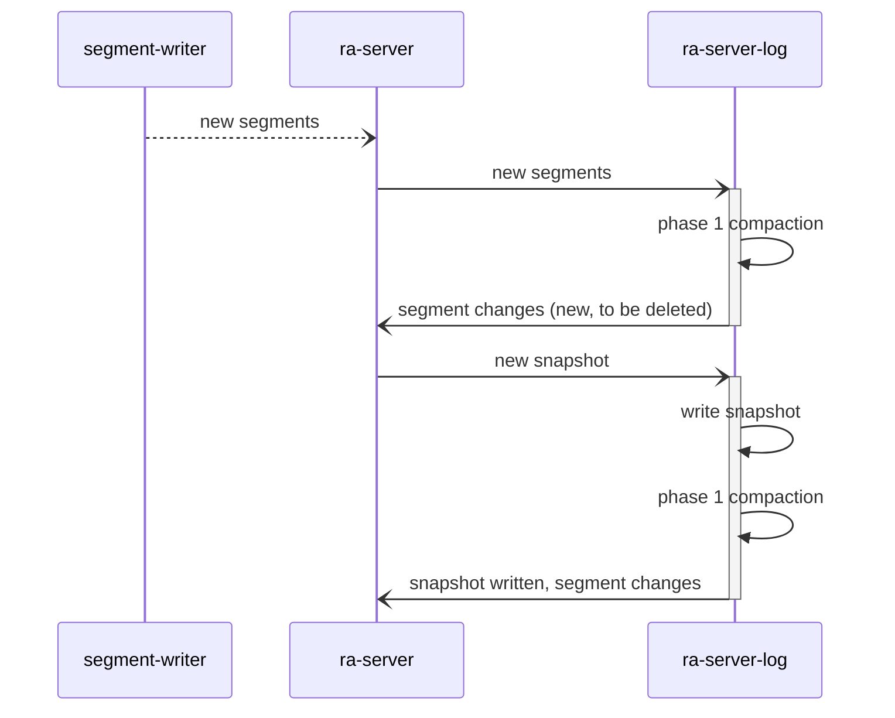

# Ra log compaction

This is a living document capturing current work on log compaction.

## Overview

Compaction in Ra is intrinsically linked to the snapshotting
feature. Standard Raft snapshotting removes all entries in the Ra log
that precedes the snapshot index where the snapshot is a full representation of
the state machine state.

The high level idea of compacting in Ra is that instead of deleting all
segment data that precedes the snapshot index the snapshot data can emit a list
of live raft indexes which will be kept, either in their original segments
or written to new compacted segments. the data for these indexes can then
be omitted from the snapshot to reduce its size and write amplification.

### Log sections

Two named sections of the log then emerge.

#### Normal log section

The normal log section is the contiguous log that follows the last snapshot.

#### Compacting log section

The compacting log section consists of all live raft indexes that are lower
than or equal to the last snapshot taken.

## Compaction phases

### Phase 1

Delete whole segments. This is the easiest and most efficient form of "compaction"
and will run immediately after each snapshot is taken.

The run will start with the oldest segment and move towards the newest segment
in the compacting log section. Every segment that has no entries in the live
indexes list returned by the snapshot state will be deleted. Standard Raft
log truncation is achieved by returning and empty list of live indexes.

### Compacted segments: naming (phase 3 compaction)

Segment files in a Ra log have numeric names incremented as they are written.
This is essential as the order is required to ensure log integrity.

Desired Properties of phase 3 compaction:

* Retain immutability, entries will never be deleted from a segment. Instead they
will be written to a new segment.
* lexicographic sorting of file names needs to be consistent with order of writes
* Compaction walks from the old segment to new
* Easy to recover after unclean shutdown

Segments will be compacted when 2 or more adjacent segments fit into a single
segment.

The new segment will have the naming format `OLD-NEW.segment`

This means that a single segment can only be compacted once e.g
`001.segment -> 001-001.segment` as after this  there is no new name available
and it has to wait until it can be compacted with the adjacent segment. Single
segment compaction could be optional and only triggered when a substantial,
say 75% or more entries / data can be deleted.

This naming format means it is easy to identify dead segments after an unclean
exit.

During compaction a different extension will be used: `002-004.compacting` and
after an unclean shutdown any such files will be removed. Once synced it will be
renamed to `.segment` and some time after the source files will be deleted (Once
the Ra server has updated its list of segments).

#### When does phase 3 compaction run?

Options:

* On a timer
* After phase 1 if needed based on a ratio of live to dead indexes in the compacting section
* After phase 1 if needed based on disk use / ratio of live data to dead.

### Ra Server log worker responsibilities

* Write checkpoints and snapshots
* Perform compaction runs
* Report segments to be deleted back to the ra server (NB: the worker does
not perform the segment deletion itself, it needs to report changes back to the
ra server first). The ra server log worker maintains its own list of segments
to avoid double processing

#### Impact on segment writer process

The segment writer process as well as the WAL relies heavily on the 
`ra_log_snapshot_state` table to avoid writing data that is no longer 
needed. This table contains the latest snapshot index for every 
ra server in the system. In order to do the same for a compacting state machine
the segment writer would need access to the list of live indexes when flushing
the WAL to segments.

Options:

* It could read the latest snapshot to find out the live indexes
* Live indexes are stored in the `ra_log_snapshot_state` table for easy access.

Snapshots can be taken ahead of the segment part of the log meaning that the
segment writer and log worker may modify the log at different times. To allow
this there needs to be an invariant that the log worker never marks the last
segment for deletion as it may have been appended to after or concurrently
to when the log worker evaluated it's state.

The segment writer can query the `ra_log_snapshot_table` to see if the server
is using compaction (i.e. have preceding live entries) and if so read the
live indexes from the snapshot directory (however it is stored). Then it
can proceed writing any live indexes in the compacting section as well as
contiguous entries in the normal log section.

Segment range: (1, 1000)

Memtable range: (1001, 2000)

Snapshot: 1500, live indexes `[1501, 1999]`,

Alt: if the log worker / Ra server is alive the segment writer could call into
the log worker and ask it to do the log flush and thus make easy use of the
live indexes list. If the Ra server is not running but is still registered
the segment writer will flush all entries (if compacting), even those preceding 
last snapshot index. This option minimises changes to segment writer but could
delay flush _if_ log worker is busy (doing compaction perhaps) when
the flush request comes in.

### Snapshot replication

With the snapshot now defined as the snapshot state + live preceding raft indexes
the default snapshot replication approach will need to change.

The snapshot sender (Ra log worker??) needs to negotiate with the follower to
discover which preceding raft indexes the follower does not yet have. Then it would
go on and replicate these before or after (??) sending the snapshot itself.

T: probably before as if a new snapshot has been taken locally we'd most likely
skip some raft index replication on the second attempt.

Q: How will the follower write the live indexes preceding the snapshot?
If the main Ra process does it this introduces a 3rd modifier of the Ra log
and there may be concurrent Ra log writes from the snapshot writer at this point.

It can't write them to the WAL as they are not contiguous unless we allow
such writes.

The Ra process can write them to a set of temporary segment files then call into
the segment writer to rename into the set of segments.
No this can't work with the
live indexes logic the segment writer applies as it relies on the mem tables
ranges to decide which indexes to flush.

having pending segment flushes when receiving 

the ra process truncates the mem table on snapshot installations
so that the segment writer avoids
writing any of the live index preceding the snapshot. 

If this is done before live indexes are replicated if the Ra process then waits
for the mt delete to complete then 

Idea: the ra server could truncate the mt as soon as a snapshot installation
starts to minimise subsequent mem table flushes. Typically this means emptying
the memtable completely (the ra server could execute the delete perhaps to ensure).

Scenario: pending mem table flushes when snapshot installation comes in.

Need to ensure the old pending data in the WAL / memtable isn't flushed _after_
the received live indexes are written to a segment and that segment is renamed
into the list of segments.

Options:

1. Call into segment writer to rename the temporary named segment(s) into the
main sequence of segments. This command will return the full list of new segments.
If the memtable has been truncated before this is done by the time the rename
returns we know there wont be any more segment records being written.
We can't update the `ra_log_snapshot_state` table until _after_ this as the 
segment writer may assume the live indexes should be in the memtable.
Also need to handle concurrent compaction?
Downside: BLOCKING, segwriter can at at times run a backlog.

2. 

##### Steps when receiving a new valid `install_snapshot_rpc`

* Once the `last` part of the snapshot has been installed and recovered as the
mem table state we can calculated which live indexes are needed to complete
the snapshot. The Ra follower remains in `receiving_snapshot` state and replies
back with a `ra_seq` of the required indexes.
    * these are received and written to the log as normal
process itself

#### Alternative snapshot install procedure

* Sender begins with sending negotiating which live indexes are needed.
* Then it proceeds to send the live indexes _before_ the snapshot (so in it's
natural order if you like).
* The receiving ra process then writes these commands to the WAL as normal but
using a special command / flag to avoid the WAL triggering its' gap detection.
Ideally the specialised command would include the previous idx so that we can
still do gap detection in the sparse sequence (should all sends include prior
sequence so this is the only mode?).
* Alt the live indexes replication could be done after the snapshot is complete
as it is easy for the follower to work out which live indexes it needs.
when it receives the `last` snapshot chunk it then replies with a special
continuation command instead of `install_snapshot_result{}` which will initiate
the live index replication. NB the snapshot sender process may need to call
into the leader process to get read plans as entries _could_ be in the memtable.

#### How to work out which live indexes the follower needs

Gnarly example:

Follower term indexes:

`{{100, 1000}, 1}, {{1001, 1500}, 2}`

Incoming snapshot at 2000 in term 3

live indexes: `[100, 600, 1200, 1777]`

Follower needs all live indexes greater than it's `last_applied` index.
This is the only safe way to ensure that the live indexes are not stale entries.

If follower `last applied` is: 1500 then follower needs: `[1777]` only.
If follower `last_applied` is: 1100 then follower needs `[1200, 1777]`

#### How to store live indexes with snapshot

* New section in snapshot file format.
* Separate file (that can be rebuilt if needed from the snapshot).

### WAL impact

The WAL will use the `ra_log_snapshot_state` to avoid writing entries that are
lower than a server's last snapshot index. This is an important optimisation
that can help the WAL catch up in cases where it is running a longer mailbox
backlog.

`ra_log_snapshot_state` is going to have to be extended to not just store
the snapshot index but also the machine's smallest live raft index (at time of
snapshot) such that the WAL can use that to reduce write workload instead of
the snapshot index.

Ideally the WAL would only write indexes the precede the snapshot if they're in
the live indexes, however this would no doubt be performance impacting so in this
case it is probably better just to have a secondary lowest live index to use
for decision making.

WAL needs to accept sparse writes without a higher snapshot idx (snap install)
WAL needs to accept contiguous writes with a higher snap idx with and without live indexes

