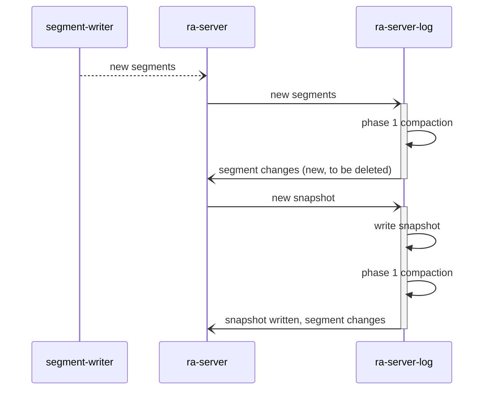
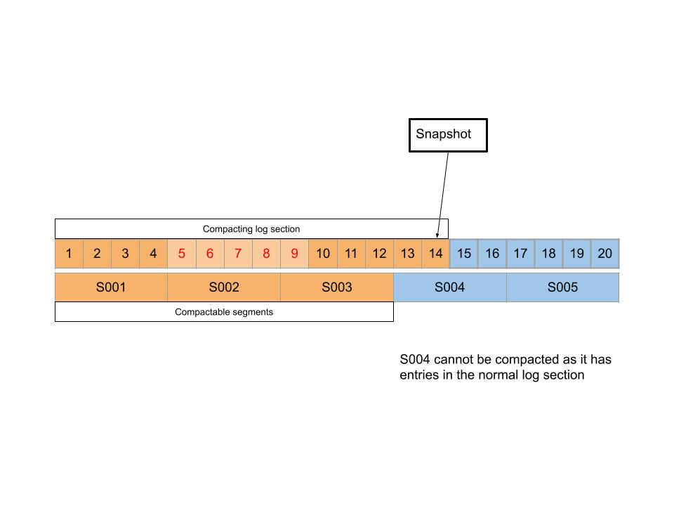
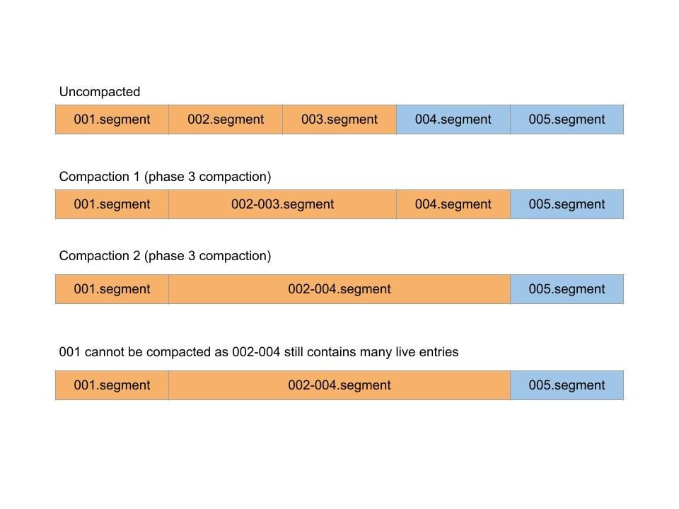

# Ra log compaction

This is a living document capturing current work on log compaction.

## Overview

Compaction in Ra is intrinsically linked to the snapshotting
feature. Standard Raft snapshotting removes all entries in the Ra log
that precedes the snapshot where the snapshot is a full representation of
the state machine state. 

### Ra Server log worker responsibilities

* Write checkpoints and snapshots
* Perform compaction runs
* report segments to be deleted back to the ra server (NB: the worker does
not perform the segment deletion itself, it needs to report changes back to the
ra server first). The ra server log worker maintains its own list of segments
to avoid double processing

```mermaid
sequenceDiagram
    participant segment-writer
    participant ra-server
    participant ra-server-log

    segment-writer--)ra-server: new segments
    ra-server-)+ra-server-log: new segments
    ra-server-log->>ra-server-log: phase 1 compaction
    ra-server-log-)-ra-server: segment changes (new, to be deleted)
    ra-server-)+ra-server-log: new snapshot
    ra-server-log->>ra-server-log: write snapshot
    ra-server-log->>ra-server-log: phase 1 compaction
    ra-server-log-)-ra-server: snapshot written, segment changes
```

### Log sections

#### Normal log section

The normal log section is the contiguous log that follows the last snapshot.

#### Compacting log section

The compacting log section consists of all live raft indexes that are lower
than or equal to the last snapshot taken.

### Compacted segments: naming (phase 3 compaction)

Segment files in a Ra log have numeric names incremented as they are written.
This is essential as the order is required to ensure log integrity.

Desired Properties of phase 3 compaction:

* Retain immutability, entries will never be deleted from a segment. Instead they
will be written to a new segment.
* lexicographic sorting of file names needs to be consistent with order of writes
* Compaction walks from the old segment to new
* Easy to recover after unclean shutdown

Segments will be compacted when 2 or more adjacent segments fit into a single
segment.

The new segment will have the naming format `OLD-NEW.segment`

This means that a single segment can only be compacted once e.g
`001.segment -> 001-001.segment` as after this  there is no new name available
and it has to wait until it can be compacted with the adjacent segment. Single
segment compaction could be optional and only triggered when a substantial,
say 75% or more entries / data can be deleted.

This naming format means it is easy to identify dead segments after an unclean
exit.

During compaction a different extension will be used: `002-004.compacting` and
after an unclean shutdown any such files will be removed. Once synced it will be
renamed to `.segment` and some time after the source files will be deleted (Once
the Ra server has updated its list of segments).

