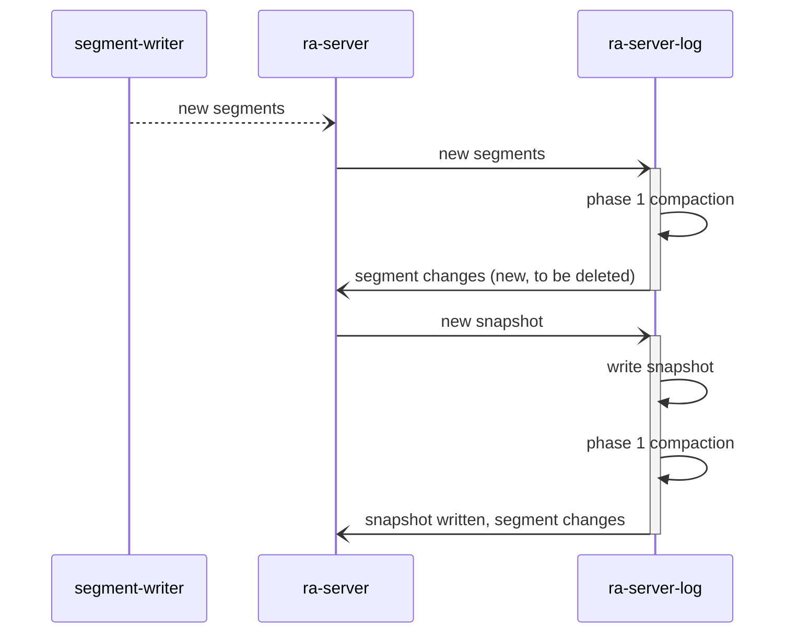

# Ra log compaction

This is a living document capturing current work on log compaction.

## Overview


Compaction in Ra is intrinsically linked to the snapshotting
feature. Standard Raft snapshotting removes all entries in the Ra log
that precedes the snapshot where the snapshot is a full representation of
the state machine state. 


### Ra Server log worker responsibilities

* Write checkpoints and snapshots
* Perform compaction runs
* report segments to be deleted back to the ra server (NB: the worker does
not perform the segment deletion itself, it needs to report changes back to the
ra server first). The ra server log worker maintains its own list of segments
to avoid double processing


### Compacted segments: naming

Segment files in a  Ra log have numeric names incremented as they are written.
This is essential as the order is required to ensure log integrity.


Retain immutability, entries will never be deleted from a segment.

do we need levels?

how about 0000001.segment.1 where each segment has an ordered number of items
but segments themselves can have non ordered ranges. Newer segments can completely

eg.

```
[{0, 5}, {7, 22}] -> compacted to [{0, 5}, {7, 22}, {3, 20}] meaning
{0, 5} can be deleted.



```mermaid
sequenceDiagram
    participant segment-writer
    participant ra-server
    participant ra-server-log

    segment-writer--)ra-server: new segments
    ra-server-)+ra-server-log: new segments
    ra-server-log->>ra-server-log: phase 1 compaction
    ra-server-log-)-ra-server: segment changes (new, to be deleted)
    ra-server-)+ra-server-log: new snapshot
    ra-server-log->>ra-server-log: write snapshot
    ra-server-log->>ra-server-log: phase 1 compaction
    ra-server-log-)-ra-server: snapshot written, segment changes
```

