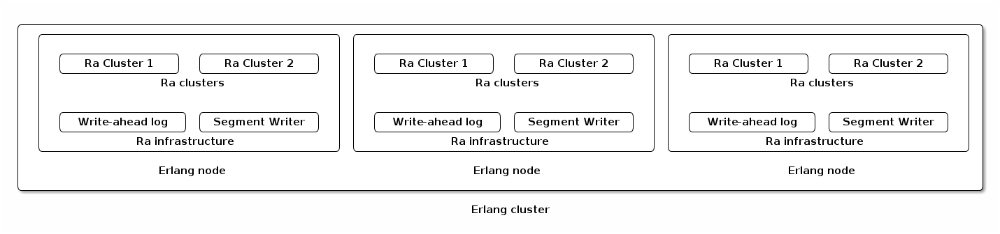
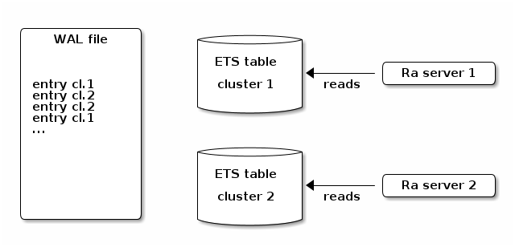
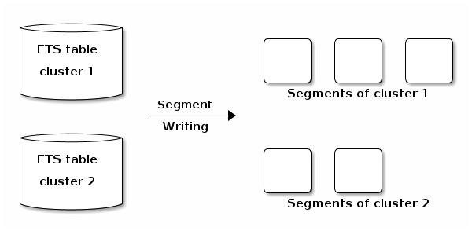

# Internals

This guide covers key implementation aspects of Ra. It is intentionally
high level since implementation details change often but overall design usually
doesn't (or the authors believe Ra is well past that point).

## Concepts and Key Modules

Ra is an implementation of Raft, a distributed consensus protocol. Raft has multiple features
that work together. They are reflected in the Ra API.

Ra assumes that there can (and usually will be) multiple Raft clusters in a given Erlang node cluster.
In case of a messaging system, a topic or queue can be its own cluster. In a data store
a data partition can be its own Raft cluster. Any long lived stateful entity that the user
would like to replicate across cluster nodes can use a Raft cluster.

Raft clusters in a single cluster are logically independent but do share some Ra infrastructure
such as the write-ahead log. This is a practical decision that avoids a lot of concurrent fsync
operations that very significantly affect system throughput.



### Key Modules

[Ra API](https://rabbitmq.github.io/ra/) has two main modules:

 * `ra`: handles cluster formation, membership and functions that are not directly related to Ra state machine
 * [`ra_machine`](./STATE_MACHINE_TUTORIAL.md): a behavior that applications implement

Applications interact with Ra clusters by sending commands. The commands are processed by the
state machine. In response for every command a new machine state is returned.

The Ra server takes care of Raft leader election, log entry replication, peer failure
handling, log reinstallation, and so on. Applications are responsible for
expressing their logic in terms of Ra commands and effects.


## Ra State Machines

There are two mandatory [`ra_machine` callbacks](https://rabbitmq.github.io/ra/ra_machine.html) that need to be
implemented:

```erlang
-callback init(Conf :: machine_init_args()) -> state().

-callback 'apply'(command_meta_data(), command(), State) ->
    {State, reply(), effects() | effect()} | {State, reply()}.
```

### init/1

`init/1` returns the initial state when a new instance of the state machine
is created. It takes an arbitrary map of configuration parameters. The parameters
are application-specific.

### apply/3

`apply/3` is the primary function that is called for every command in the
Raft log. It takes Raft state machine metadata as a map (most importantly the Raft index and current term),
a command and the current state.

It must return the new state, a list of effects (in execution order) and a reply.
Replies will be returned to the caller
only if they performed a synchronous call or they requested an asynchronous notification
using `ra:pipeline_command/{3/4}`.

``` erlang
-type effects() :: [effect()].
-type reply() :: term().
-type command() :: user_command() | builtin_command().
-type command_meta_data() :: ra_server:command_meta() | #{index := ra_index(),
                                                         term := ra_term()}.

-spec apply(machine(), command_meta_data(), command(), State) ->
    {State, reply(), effects() | effect()} | {State, reply()}.
```


## Effects

Effects are used to separate the state machine logic from the side effects it wants
to take inside its environment. Each call to the `apply/3` function can return
a list of effects for the leader to realise. This includes sending messages,
setting up server and process monitors and calling arbitrary functions.

In other words, effects are everything that's not related to Raft state machine
transitions.

### Effect Application and Failure Handling

Under normal operation only the leader that first applies an entry will attempt the effect.
Followers process the same set of commands but simply throw away any effects returned by
the state machine.

To ensure we not re-issue effects on recovery each `ra` server persists its `last_applied` index.
When the server restarts it replays it's log until this point and throws away any resulting effects as they
should already have been issued.

As the `last_applied` index is only persisted periodically there is a small
chance that some effects may be issued multiple times when all the servers in the
cluster fail at the same time. There is also a chance that effects will
never be issued or reach their recipients. Ra makes no allowance for this.

It is worth taking this into account when implementing a state machine.

The [Automatic Repeat Query (ARQ)](https://en.wikipedia.org/wiki/Automatic_repeat_request) protocol
can be used to implement reliable communication (Erlang message delivery) given the
above limitations.

A number of effects are available to the user.

### Sending a message

The `{send_msg, pid(), Msg :: term()}` effect asynchronously sends a message
to the specified `pid`.

`ra` uses `erlang:send/3` with the `no_connect` and `no_suspend`
options which is the least reliable way of doing it. It does this so
that a state machine `send_msg` effect will never block the main `ra` process.

To ensure message reliability, [Automatic Repeat Query (ARQ)](https://en.wikipedia.org/wiki/Automatic_repeat_request)-like
protocols between the state machine and the receiver should be implemented
if needed.

### Monitoring

The `{monitor, process | node, pid() | node()}` effect will ask the `ra` leader to
monitor a process or node. If `ra` receives a `DOWN` for a process it
is monitoring it will commit a `{down,  pid(), term()}` command to the log that
the state machine needs to handle. If it detects a monitored node as down or up
it will commit a `{nodeup | nodedown, node()}` command to the log.

Use `{demonitor, process | node, pid() | node()}` to stop monitoring a process
or a node.

All monitors are invalidated when the leader changes. State machines should
re-issue monitor effects when becoming leader using the `state_enter/2`
callback.

### Calling a function

The `{mod_call, module(), function(), Args :: [term()]}` to call an arbitrary
function. Care need to be taken not to block the `ra` process whilst doing so.
It is recommended that expensive operations are done in another process.

The `mod_call` effect is useful for e.g. updating an ETS table of committed entries
or similar.

### Setting a timer

The `{timer, Name :: term(), Time :: non_neg_integer() | infinity}` effects asks the Ra leader
to maintain a timer on behalf of the state machine and commit a `timeout` command
when the timer triggers. If setting the time to `infinity`, the timer will not be started
and any running timer with same name will be cancelled.

The timer is relative and setting another timer with same name before the current 
timer runs out results in the current timer being reset.

All timers are invalidated when the leader changes. State machines should
re-issue timer effects when becoming leader using the `state_enter/2`
callback.

### Reading a log

Use `{log, Indexes :: [ra_index()], fun(([user_command()]) -> effects()}` to read
commands from the log from the specified indexes and return a list of effects.

Effectively this effect transforms log entries into effects.

Potential use cases could be when a command contains large binary data and you
don't want to keep this in memory but load it on demand when needed for a side-effect.

This is an advanced feature and will only work as long as the command is still
in the log. If a `release_cursor` has been emitted with an index higher than this
the command may not longer be in the log and the function will not be called.

There is currently no facility for reading partial data from a snapshot.

### Updating the Release Cursor (Snapshotting)

The `{release_cursor, RaftIndex, MachineState}`
effect can be used to give Ra cluster members a hint to trigger a snapshot.
This effect, when emitted, is evaluated on all nodes and not just the leader.

It is not guaranteed that a snapshot will be taken. A decision to take
a snapshot or delay is taken using a number of internal Ra state factors.
The goal is to minimise disk I/O activity when possible.

### State Machine Versioning

It is eventually necessary to make changes to the state machine
code. Any changes to a state machine that would result in a different end state when
the state is re-calculated from the log of entries (as is done when restarting a ra server)
should be considered breaking.

As Ra state machines need to be deterministic any changes to the logic inside the `apply/3` function
 _needs to be enabled at the same index on all members of a Ra cluster_.

#### Versioning API

Ra considers all state machines versioned starting with version 0. State machines
that need to be updated with breaking changes need to implement the optional
versioning parts of the `ra_machine` behaviour:

``` erlang
-type version() :: non_neg_integer().

-callback version() -> pos_integer().

-callback which_module(version()) -> module().

```

`version/0` returns the current version which is an integer that is
higher than any previously used version number. Whenever a breaking change is
made this should be incremented.

`which_module/1` maps a version to the module implementing it. This allows
developers to optionally keep entire modules for old versions instead of trying
to handle multiple versions in the same module.

E.g. when moving from version 0 of `my_machine` to version 1:

1. Copy and rename the `my_machine` module to `my_machine_v0`

2. Implement the breaking changes in the original module and bump the version.

``` erlang
version() -> 1.

which_module(1) -> my_machine;
which_module(0) -> my_machine_v0.

```

This would ensure that any entries added to the log are applied against the active machine version
at the time they were added, leading to a deterministic outcome.

For smaller (but still breaking) changes that can be handled in the original
module it is also possible to switch based on the `machine_version` key included in the meta
data passed to `apply/3`.

#### Runtime Behaviour

New versions are enabled whenever a there is a quorum of members with a higher version and
one of them is elected leader. The leader will commit the new version to the
log and each follower will move to the new version when this log entry is applied.
Followers that do not yet have the new version available will receive log entries from the leader
and update their logs but will not apply log entries. When they are upgraded and have
the new version, all outstanding log entries will be applied. In practical terms this means
that Ra nodes can be upgraded one by one.

In order to be upgradeable, the state machine implementation will need to handle the version
bump in the form of a command that is passed to the `apply/3` callback:
`{machine_version, OldVersion, NewVersion}`. This provides an
opportunity to transform the state data into a new form, if needed. Note that the version
bump may be for several versions so it may be necessary to handle multiple
state transformations.


#### Limitations

Ra does not support the Erlang hot code swapping mechanism.


## Cluster Setup

There are two approaches to forming a cluster:

 * All cluster members can be known ahead of time
 * All cluster members can be joining existing members dynamically (this implies that one "seed" member is chosen and started first)

### Fixed Set of Members Known on Startup

Use `ra:start_or_restart_cluster/3` on one of the nodes to set up a cluster.
This will either create a new cluster or restart an existing one.
As cluster membership is persisted in Ra logs, newly added nodes will be discovered from the log.

### Dynamically Joining Nodes

With this approach there has to be a "preconfigured" or "seed" nodes that other nodes
will join. Nodes that join the seed later **will discard all their state** before joining.

Ra API supports two options: the joining node can either have existing state
(in which case it has to be discarded with `ra:force_delete_server/1`) or be completely fresh nodes.

Start a local server with `ra:start_server/1`, then call `ra:add_member/2` on an existing cluster member.
The newly started node joins the existing cluster as a follower and replicates the existing log,
after which it will be a regular member of the cluster.


## Identity

Since Ra assumes multiple clusters running side by side in a given Erlang cluster,
each cluster and cluster member must have their own identities.

### Cluster Name

A cluster name in Ra is defined as `binary() | string() | atom()`.

The cluster name is mostly a "human-friendly" name for a Ra cluster.
Something that identifies the entity the cluster is meant to represent.
The cluster name isn't strictly part of a cluster's identity.

For example, in RabbitMQ's quorum queues case cluster names are derived from queue's identity.

### Server ID

A Ra server is a Ra cluster member. Server ID is defined as a pair of `{atom(), node()}`.
Server ID combines a locally registered name and the Erlang node it resides on.

Since server IDs identify Ra cluster members, they need to be a
persistent addressable value that can be used as a target for sending
messages. A `pid()` would not work as it isn't persisted across
process restarts.

While it's more common for each server within a Ra cluster to
be started on a separate Erlang node, `ra` also supports the scenario
where multiple Ra servers within a cluster are placed on the same
Erlang node.

Ra servers are locally registered process to avoid depending on a
distributed registry (such as the `global` module) which does not
provide the same consistency and recovery guarantees.

### UID

Each Ra server also needs an ID that is unique to the local Erlang
node _and_ unique across incarnations of `ra` clusters with the same
cluster ID.

This is to handle the case where a Ra cluster with the same name is
deleted and then re-created with the same cluster id and server ids
shortly after. In this instance the write-ahead log may contain
entries from the previous incarnation which means we could be mixing
entries written in the previous incarnation with ones written in the
current incarnation which obviously is unacceptable. Hence providing a
unique local identity is critical for correct operation.

The IDs are used to identify a Ra server's data on disk and must be
filename-safe and conform to the [base64url
standard](https://tools.ietf.org/html/rfc4648#section-5)

Ra cluster members also use IDs that are unique to that member.
The IDs assume Base64 URI-encoded binaries that can be safely used
as directory and file name values on disk.

When `ra:start_server/4` or `ra:start_cluster/3` are invoked, an UID
is automatically generated by Ra.

This is used for interactions with the write-ahead log,
segment and snapshot writer processes who use the `ra_directory` module to
lookup the current `pid()` for a given ID.


A UID can be user-provided. Values that conform to the [base64url
standard](https://tools.ietf.org/html/rfc4648#section-5) must be used.


Here's an example of a compliant user-provided UID:


```
Config = #{cluster_name => <<"ra-cluster-1">>,
           server_id => {ra_cluster_1, ra1@snowman},
           uid => <<"ra_cluster_1_1519808362841">>
           ...},

```


## Group Membership

Ra implements the single server cluster membership change strategy
covered in [Consensus: Bridging Theory and Practice][https://raft.github.io/raft.pdf].
In practice that means that join and leave requests are processed sequentially one by one.

The function that manage cluster members, `ra:add_member/2` and `ra:remove_member/2`, respectively,
will return as soon as the membership change state transition has been written to the log and the leader
has switched to the new configuration.

## Client Leader Tracking

To interact with a Ra cluster client processes need to first discover and subsequently
track the leader of the cluster.

Synchronous commands such as `ra:process_command/2`, `ra:members/1` always redirect
to the current leader (if known) and returns the leader's server id as
as the 3rd item in success response. The client process can then use this return
value to avoid the redirection overhead for future calls.

When using the asynchronous API such as `ra:pipeline_command/2|3|4` it is best if
the client first uses a synchronous call such as `ra:members/1` to discover the current
leader and direct asynchronous commands to this member.

Alternatively clients can use the `ra_leaderboard:lookup_leader/2` function to lookup
the locally known current leader of the cluster by its cluster name. If there is
no local member of the Ra cluster or the leader is not known this function returns
`undefined`. In this case the client process should fall back to synchronous discovery.

## Raft Extensions and Deviations

Ra aims to fit well within the Erlang environment as well as provide good adaptive throughput.
Therefore it has deviated from the original Raft protocol in certain areas.

### Replication

Log replication in Ra is mostly asynchronous, so there is no actual use of RPC (as in the Raft paper) calls.
New entries are pipelined and followers reply after receiving a written event which incurs
a natural batching effects on the replies.

Followers include 3 non-standard fields in their Raft `AppendEntries` RPC replies:

* `last_index`, `last_term` - the index and term of the last fully written entry. The leader uses these
   to calculate the new `commit_index`.

* `next_index` - this is the next index the follower expects. For successful replies it is not set,
   or is ignored by the leader. It is set for unsuccessful replies and is used by the leader to update its `next_index`
   for the follower and resend entries from this point.

To avoid completely overwhelming a slow follower the leader will only
pipeline if the difference between the `next_index` and `match_index` is
below some limit (currently set to 1000).

Follower that are considered stale (i.e. the match_index is less then next_index - 1) are still
sent an append entries message periodically, although less frequently
than recommended in the Raft paper. This is done to ensure follower
liveness. In an idle system where all followers are in sync no further
messages will be sent to reduce network bandwidth usage.


### Failure Detection

Ra doesn't rely on the Raft paper's approach to peer failure detection
where the leader periodically sends append entries messages to enforce its leadership.

Ra is designed to support potentially thousands of concurrently running clusters within an
Erlang cluster and having all these doing their own failure detection
has proven excessive in terms of bandwidth usage.

In Ra, leaders will not send append entries unless there is an update to be
sent. It means followers don't (typically) set election timers.

This leaves the question on how failures are detected and elections
are triggered.

Ra tries to make use as much of native Erlang failure detection
facilities as it can. Process or node failure scenario are handled using
Erlang monitors. Followers monitor the currently elected leader and if they receive a
'DOWN' message as they would in the case of a crash or sustained
network partition where Erlang distribution detects a node isn't
replying, the follower _then_ sets a short, randomised election
timeout.

This only works well in crash-stop scenarios. For network partition
scenarios Ra could rely on Erlang distribution's net ticks mechanism to detect the partition
but this could easily take 30-60 seconds by default to happen which is too slow.

This is why the `ra` application uses [Aten](https://github.com/rabbitmq/aten), a separate node failure
detection library developed alongside it.

Aten monitors Erlang nodes. When it suspects an Erlang node is down
it notifies local `ra` servers of this. If this Erlang node hosts the currently
known `ra` leader the follower will start an election.

Ra implements a ["pre-vote" member state](https://raft.github.io/raft.pdf)
that sits between the "follower" and "candidate" states.
This avoids cluster disruptions due to leader failure false positives.


## Log Implementation

Ra is designed to support potentially thousands of Ra servers per Erlang node.
As all data needs to be safely persisted and fsync-ed to disk before it can be
actioned it is not practical or performant to have each server write log entries
to their own log files. Ra's log design instead is optimised to avoid
parallel calls to `fsync(1)` and thus need to funnel all log entry writes
through a common component, named the *write-ahead log*
(although strictly speaking there is no "ahead" in this sense).

All messages are sent asynchronously to maximise throughput with
[ARQ](https://en.wikipedia.org/wiki/Automatic_repeat_request)-like
protocols where needed.

There are several processes involved in the Ra log implementation.

### The Ra Server

The Ra server initiates all write operations and coordinates all notifications
received from the other processes. It is usually the only process that reads from
the log, even if it is possible to attach [external readers](#external-log-readers) to the log.

Under normal operations reads from the log are done from in-memory ETS tables but it may
occasionally read from log segments on disk, particularly when recovering
after a restart. These ETS tables are maintained by the write-ahead log component.

### The Write-ahead Log (WAL)

This is the process that's first to accept all write operations.

The storage of the WAL is made of 2 parts:
 * a file where the entries of all Ra servers are written.
 * in-memory ETS tables that contain and will serve the entries for individual Ra servers.



#### WAL's file

The WAL appends entries from all Ra servers running on the current Erlang node to a single file
and calls `fsync(1)` after a certain number of writes have been performed _or_ there are no further
write operations pending in its mailbox.

After each batch it notifies each Ra server that had a write in
that batch so that it can consider the entry written.

The WAL tries to adapt to load by dynamically increasing the max number of
writes per batch, trading latency for throughput.

Depending on the system a call to `fsync(1)` can block for several milliseconds.
Typically the size of a WAL batch is tuned to the number of messages received
during the `fsync(1)` call. The WAL then quickly writes all pending entries to
disk, calls `fsync(1)` which will accumulate further writes and so on.

The WAL file is optimised for writing because it is only read on recovery (when the system has stopped or crashed
and the last known state of Ra servers need to be restored.)

#### WAL's ETS tables

The WAL writes each entry to a per-Ra-server ETS table (similar to
Cassandra and RocksDB MemTables, see
[Log Structured Storage](https://www.igvita.com/2012/02/06/sstable-and-log-structured-storage-leveldb/))
which the Ra server uses to read data from its log.

So the ETS tables are a way to access entries, but they are not the only place
where entries are stored though (more on this later).

The ETS tables are typically used by Ra servers once entries have been replicated and got consensus.
Ra servers look up confirmed entries with their index and apply them to their state machine.

> Ra servers maintain also a short-lived cache of their entries which can be
> used whenever an entry needs to be looked up. This cache is pruned when
> an entry is confirmed by the WAL (meaning, fully written to disk). Depending
> on the timing, an entry can be looked up from this cache if it is there
> (the fastest) or from an ETS table. An example of the usage of this cache
> is when the leader gets a consensus for an entry before the confirmation of its
> own WAL, the entry is looked up from the cache and applied to the state machine.
> We'll see later that entries can be stored in yet another place, segment files.
> So whenever an entry is needed, Ra will go through these
> 3 storage mechanisms to look it up: cache, ETS tables, segment files.

### The Segment Writer

To avoid perpetually appending to and ever growing file the WAL periodically
"rolls over" to a new file. The old file and the mem tables written during
the lifetime of that file are passed to the segment writer process that is
responsible for flushing the mem tables to per-Ra-server specific on disk
storage. The data is stored in variably sized segments with a fixed number of
log entries.



When the segment writer has finished flushing all the ETS tables for all the
Ra servers that wrote to the WAL file it deletes the WAL file
(and the ETS tables as well.)

The segment writer keeps track of the most recent snapshot index for each
Ra server; it then uses that information to avoid performing writes for entries
that potentially have been truncated.

#### Segment Writing and WAL's ETS tables

Ra distinguishes between open and closed WAL's ETS tables. A Ra server
can have only 1 (or none) open ETS table at a time. This open ETS table
contains the entry that are in the current WAL file.

During WAL rollover, open ETS tables become closed because they won't be appended
to anymore. Closed ETS tables only exist while the segment writer is flushing
them to disk. Once their content is on disk (in segments), they are deleted.

Because the segment writer may have a backlog, there can be many closed ETS tables,
but typically there are none.

So to read from an (open) ETS table, there are at least 2 ETS lookups:
one on the `ra_log_open_mem_tables` table to get the current range of the
open tables and then another one to get the actual entry from the table itself.

Ra servers are in charge of the deletion of closed ETS tables. The reason
for this is that a Ra server may be between a range lookup and a table read,
so another process like the segment writer cannot delete the table meanwhile.

So after a flush, the segment writer sends information to Ra servers, like
the list of the new and updated segments, and which ETS tables were used
for the update. The Ra server can then delete these tables safely.

If entries from this closed and deleted tables are needed later, they will
be read from segments directly.

### The Snapshot Writer

Ra servers offload the work of persisting snapshots to the snapshot writer
process so that a large snapshot write does not block the Ra server
unnecessarily. After a Ra server has written a snapshot it can delete any
segments that only contain entries with a lower index than the snapshot.

### Write interaction overview

A simplified view of the lifetime of a single write.


### External Log Readers

Any process can register to be notified about log events (new segments, lower bound),
it can then perform some queries for its own needs, typically reading entries.

One potential use case of external log readers is to offload some busy processes (e.g. AMQP queues)
and let other processes (e.g. AMQP channels) re-read entries, to avoid slowing down
critical processes too much.

External log readers can also be used to implement multi-DC log replication. Those
readers could even only read and replicate committed entries.

## Recovery

Recovery is the process of restarting after the system has stopped (normally or abruptly).

When the WAL starts up, it scans its directory for WAL files. It reads each WAL file
from start to finish to rebuild the ETS tables that would have existed and then pass them to the segment writer
to flush them. It does this to make sure all entries are in their respective server segments.

If the system crashed while flushing to segments this does mean some entries may be re-written into segments,
but this is better than losing them. Those duplicated entries will be de-duplicated later on anyway.

Then Ra servers read their respective segments and re-apply entries to get to the last state of their state machine.

## Snapshotting

TBD: currently undergoing changes
