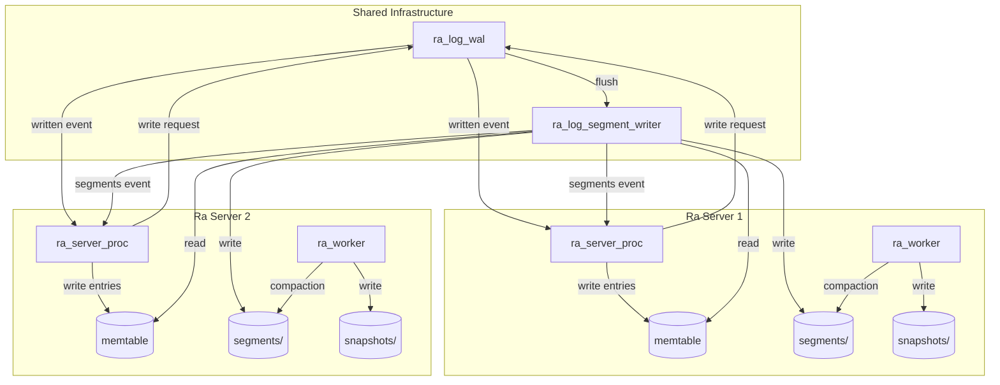
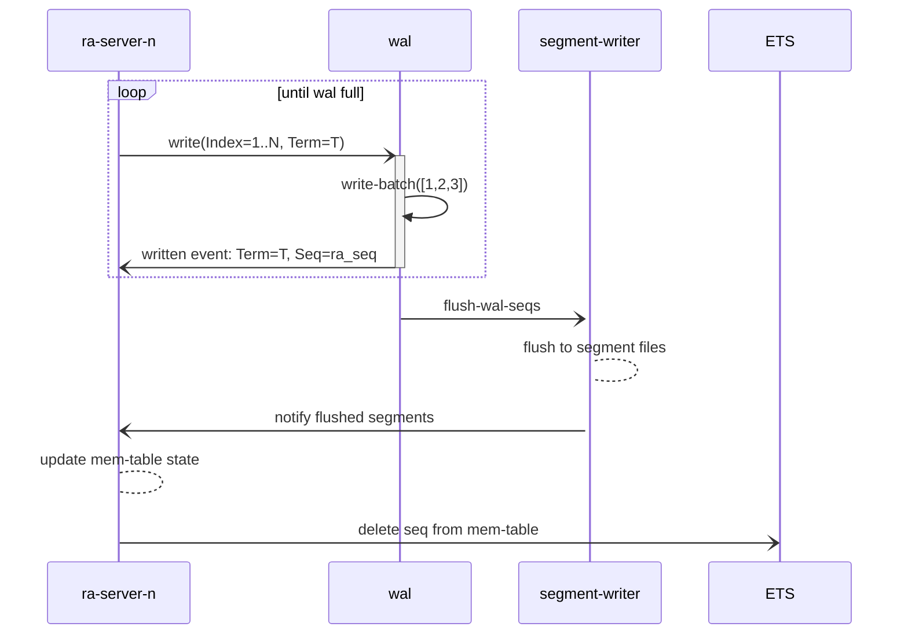
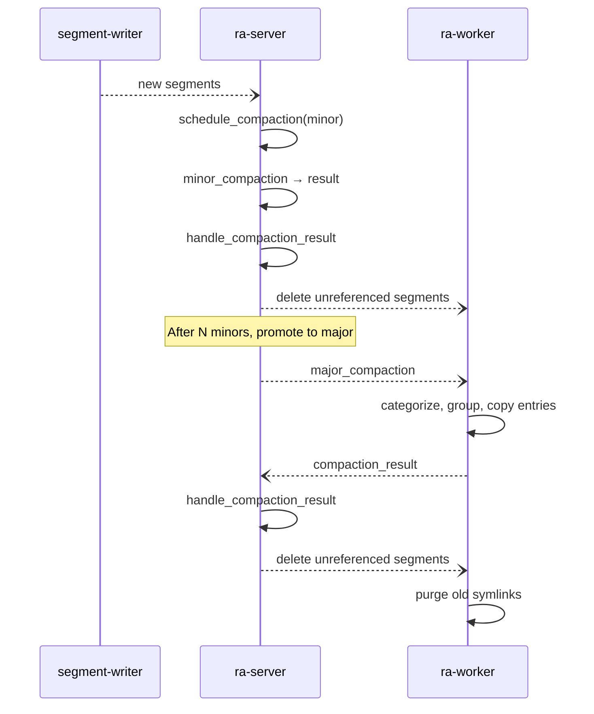
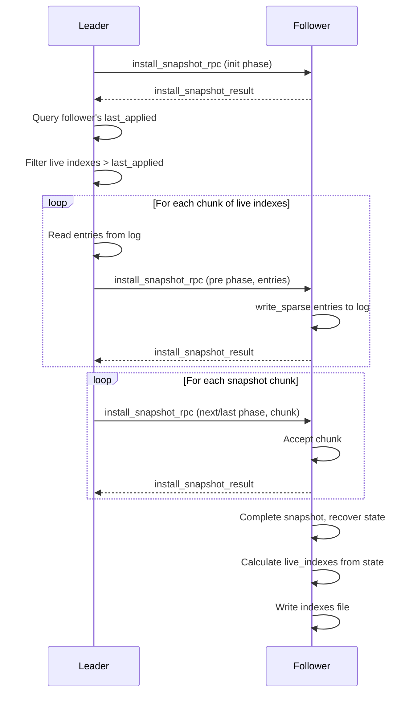

# Ra Log Internals

This document describes the Ra log implementation, covering the v2 architecture
and all v3 features including log compaction and snapshot replication with
live indexes.

## Overview

Ra is designed to support potentially thousands of Ra servers per Erlang node.
As all data needs to be safely persisted and fsync'd to disk before it can be
actioned, it is not practical or performant to have each server write log entries
to their own log files. Ra's log design is optimised to avoid parallel calls to
`fsync(1)` by funneling all log entry writes through a common component: the
**Write-Ahead Log (WAL)**.



### Evolution of the Ra Log

- **v1**: WAL process wrote to both disk and per-server ETS memtables. Each
  writer had a unique ETS table per WAL file lifetime.

- **v2**: Ra servers write to memtables before sending to WAL. Memtables are
  no longer tied to WAL file lifetime. This reduces WAL workload and eliminates
  the need for separate per-server ETS tables.

- **v3**: Introduces log compaction with live indexes. State machines can
  specify which log entries to retain beyond the snapshot boundary, enabling
  efficient storage for applications that read values from the log on demand.

## Core Components

### In-Memory Tables (Memtables)

**Module**: `ra_mt`

Memtables are owned and created by the `ra_log_ets` process. Ra servers call
into the process to create new memtables, and a registry of current tables is
kept in the `ra_log_open_memtables` table.

**Key Invariant**: Entries can be written or deleted but never overwritten.

During normal operation, each Ra server writes to a single ETS memtable.
Entries that are no longer required (due to snapshotting or having been written
to disk segments) are deleted. The actual delete operation is performed by
`ra_log_ets` on request by Ra servers.

New memtables are created when:

1. A server needs to overwrite indexes in its log (typically when a leader
   steps down with uncommitted entries)
2. The memtable exceeds 1M entries (to avoid memory issues with large tables
   even after individual deletions)

When a new memtable is created, old ones are kept until emptied, then deleted.

#### Sparse Insert Support

For snapshot replication with live indexes, memtables support sparse inserts
via `ra_mt:insert_sparse/3`. This allows non-contiguous entries to be written
during the snapshot installation pre-phase.

### Write-Ahead Log (WAL)

**Module**: `ra_log_wal`

The WAL process has the following responsibilities:

- Write entries to disk and notify writer processes when entries are synced
- Track sequences (`ra_seq:state()`) written by each writer for each ETS table
- Notify the segment writer when a WAL file fills up
- Recover memtables from WAL files after system restart



#### WAL and Snapshot State

The WAL uses `ra_log_snapshot_state:smallest/2` to avoid writing entries that
are lower than a server's smallest live index. This optimisation helps the WAL
catch up when running with a longer mailbox backlog.

The WAL also:
- Accepts sparse writes via `ra_log_wal:write/7` with explicit `PrevIndex`
- Tracks sparse sequences in memory tables via `ra_mt` using `ra_seq:state()`
- Sends `ra_seq` of written entries to segment writer (not just ranges)

### Segment Writer

**Module**: `ra_log_segment_writer`

When a WAL file reaches its max size limit, the WAL sends the segment writer
a map of `#{ra_uid() => [{ets:tid(), ra_seq:state()}]}` describing the
"tid sequences" that need to be written to disk for each Ra server.

The range actually written can be dynamically truncated based on:

1. **Snapshot index**: If a Ra server writes a snapshot at index 1500 while
   flushing range `{1000, 2000}`, the segment writer updates to `{1501, 2000}`

2. **Live indexes**: With compaction, the segment writer queries
   `ra_log_snapshot_state` for live indexes and only writes entries that are
   either above the snapshot index or in the live indexes set

The latest snapshot index and live indexes for each Ra server are kept in the
`ra_log_snapshot_state` ETS table with structure:

```erlang
{UId, SnapshotIndex, SmallestLiveIndex, LiveIndexes}
```

### WAL Gap Detection and Resend Mechanism

The WAL must maintain a contiguous sequence of log entries for each writer.
If entries arrive out of order or with gaps, the WAL cannot accept them as
this would create holes in the durable log that violate Raft invariants.

#### Writer State Tracking

The WAL tracks each writer's state in a map:

```erlang
writers = #{ra_uid() => {in_seq | out_of_seq, LastIndex :: ra_index()}}
```

- `{in_seq, LastIndex}` - Normal state. The writer's last successfully written index.
- `{out_of_seq, LastIndex}` - Gap detected. No writes accepted until the gap is filled.

#### Gap Detection

When the WAL receives a write request, it checks if the entry is contiguous:

```
Expected: PrevIdx (from write request) <= LastIndex (WAL's record)
```

If this check fails and it's not a truncating write, a gap has been detected.

#### Resend Protocol

```
Ra Server                         WAL
    |                              |
    |-- write(Idx=10) -----------> |  writers[UId] = {in_seq, 10}
    |   (Idx=11 lost/delayed)      |
    |-- write(Idx=12) -----------> |  Gap! Expected prev=11, have=10
    |                              |  writers[UId] = {out_of_seq, 10}
    |<-- {resend_write, 11} ------ |
    |                              |
    |-- resend(Idx=11) ----------> |  Prev=10 ✓, write succeeds
    |                              |  writers[UId] = {in_seq, 11}
    |-- resend(Idx=12) ----------> |  Prev=11 ✓, write succeeds
    |                              |  writers[UId] = {in_seq, 12}
```

#### Resend Throttling

To prevent resend storms, the Ra server tracks when the last resend occurred
and will not resend again within a configurable window (default: 20 seconds).
The throttle is bypassed if:

- The window has elapsed
- The WAL process has restarted (detected by pid change)

## Log Compaction

Compaction in Ra is intrinsically linked to snapshotting. Standard Raft
snapshotting removes all entries below the snapshot index. With compaction,
state machines can specify **live indexes** to retain beyond the snapshot
boundary.

### The Live Indexes Callback

State machines implement the optional `live_indexes/1` callback:

```erlang
-callback live_indexes(state()) -> [ra:index()] | {ra_seq, ra_seq:state()}.
```

Returning an empty list `[]` results in standard Raft log truncation behaviour.

**Example**: The `ra_kv` key-value store keeps only `Key => RaftIndex` in memory
and reads values from disk on demand:

```erlang
live_indexes(#state{keys = Keys}) ->
    [Idx || _K := {Idx, _Hash} <- Keys].
```

### Log Sections

Two named sections of the log emerge with compaction:

```
                    Snapshot Index
                         |
    [--Compacting Section--][----Normal Log Section----]
         Live Indexes       Contiguous entries after snapshot
```

- **Normal log section**: Contiguous log following the last snapshot
- **Compacting log section**: Live raft indexes at or below the snapshot index

### Minor Compaction (Phase 1)

Minor compaction identifies and deletes whole segments with no live entries.

**When it runs**: After each snapshot is taken.

**How it works**:
1. Get all "compactable" segment refs (segments with end index ≤ snapshot index)
2. For each segment, check if any indexes are in the live indexes list
3. Segments with zero live indexes are marked as "unreferenced" and deleted

Minor compaction runs synchronously in the Ra server process as it only
involves checking ranges and deleting files.

**Special case**: If `LiveIndexes == []` (standard Raft behaviour), ALL
compactable segments are deleted immediately.

### Major Compaction (Phase 3)

Major compaction consolidates multiple segments by copying only live entries
into new, smaller segments. This runs in the background `ra_worker` process.

**When it runs**:
- Automatically after N minor compactions (configurable via `{num_minors, N}`)
- Manually via `ra:trigger_compaction/1`

**Configuration**:

```erlang
#{major_strategy => {num_minors, 5}}  %% trigger major after 5 minor compactions
#{major_strategy => manual}           %% only manual triggering
```

#### Compaction Groups

A **compaction group** is a set of adjacent segments whose live entries will
be merged into a single new segment.

**Formation algorithm**:

1. **Check compaction benefit**: A segment is added to a group if:
   - `NumLiveEntries / TotalEntries < 0.5` (less than 50% live), OR
   - `LiveDataSize / TotalDataSize < 0.5` (less than 50% live data)

2. **Check size limits**: Adding must not exceed `max_count` or `max_size`

3. **Handle dense segments** (≥50% live entries AND data):
   - If group is empty → skip this segment
   - If group has entries → finalize group, start fresh

**Example**:

```
Segments (oldest to newest):
  Seg1: 1000 entries, 200 live (20%) → Add to Group A
  Seg2: 1000 entries, 300 live (30%) → Add to Group A
  Seg3: 1000 entries, 800 live (80%) → Dense! Finalize Group A, skip Seg3
  Seg4: 1000 entries, 100 live (10%) → Start Group B
  Seg5: 1000 entries, 150 live (15%) → Add to Group B

Result:
  Group A: [Seg1, Seg2] → merged into new segment
  Group B: [Seg4, Seg5] → merged into new segment
  Seg3: unchanged (too dense)
```

#### Compaction File Naming and Recovery

**File naming**:
- Compacting segment: `<first_segment_name>.compacting`
- Compaction marker: `<first_segment_name>.compaction_group`
- Marker contains: `term_to_binary([Seg1Fn, Seg2Fn, ...])`

**Compaction sequence**:
1. Write marker file with list of segment filenames in the group
2. Create `.compacting` segment and copy all live entries
3. Close and sync the `.compacting` segment
4. Create symlinks for additional segments pointing to the first
5. Rename `.compacting` to replace the first segment (atomic on POSIX)
6. Delete the marker file

**Recovery after crash**:
- No marker file: No pending compaction
- Marker with single segment: Delete `.compacting` and marker
- Marker with multiple segments, no symlinks: Delete `.compacting` and marker
- Marker with multiple segments, symlinks exist: Complete the compaction

**Symlink cleanup**: Symlinks are deleted after 60 seconds to ensure in-flight
reads can complete.

### Compaction Architecture



### Compaction Result Handling

The `#compaction_result{}` record contains:

```erlang
-record(compaction_result,
        {unreferenced = [] :: [file:filename_all()],  %% segments to delete
         linked = [] :: [file:filename_all()],        %% segments now symlinks
         compacted = [] :: [segment_ref()]}).         %% new segment refs
```

When processing:
1. Remove `unreferenced` and `linked` segments from segment refs
2. Add `compacted` segments to segment refs
3. Evict all open segments from cache (they may have changed)
4. Schedule background deletion of `unreferenced` files

## Snapshot Replication with Live Indexes

With compaction, the snapshot is now defined as the snapshot state plus live
preceding raft indexes. Snapshot replication includes a "pre" phase for live
entries.

### Snapshot Install Protocol



### Pre-Phase Details

1. **Negotiation**: Leader sends `init` phase to prepare follower
2. **Query last_applied**: Leader queries follower's `last_applied` via
   `ra_counters:counters/2`
3. **Filter indexes**: Remove live indexes ≤ follower's `last_applied`
4. **Send entries**: Live entries sent in chunks of 16 using `pre` phase

The follower writes sparse entries using `ra_log:write_sparse/3` which:
- Bypasses contiguous gap detection
- Includes previous index for sparse sequence tracking
- Stores entries in memtable using `ra_mt:insert_sparse/3`

### Determining Needed Live Indexes

The follower needs all live indexes greater than its `last_applied` index.

**Example**:
- Snapshot at index 2000, term 3
- Live indexes: `[100, 600, 1200, 1777]`
- Follower `last_applied` = 1500: needs `[1777]` only
- Follower `last_applied` = 1100: needs `[1200, 1777]`

### Indexes File Format

Live indexes are stored in a file named `indexes` in the snapshot directory:

```
"RASI"           (4 bytes - magic)
Version          (1 byte - unsigned, currently 1)
CRC32            (4 bytes - unsigned 32-bit integer)
Data             (binary - term_to_binary of ra_seq:state())
```

On snapshot recovery, `ra_snapshot:indexes/1` reads this file to restore the
live indexes sequence. Backward compatibility is maintained for old format
files without the header.

## Checkpoints

Checkpoints are lightweight snapshots that are not immediately fsync'd to disk.
They provide a recovery point that can be promoted to a full snapshot.

### Checkpoint vs Snapshot

| Aspect | Checkpoint | Snapshot |
|--------|------------|----------|
| fsync | Deferred until promotion | Immediate |
| Durability | May be lost on crash | Guaranteed |
| Use case | Frequent state capture | Durable recovery point |

### Checkpoint Lifecycle

1. **Creation**: `ra_log:checkpoint/5` creates a checkpoint without fsync
2. **Storage**: Stored in `<data_dir>/checkpoints/Term_Index/`
3. **Promotion**: `ra_snapshot:promote_checkpoint/2`:
   - Calls `Mod:sync/1` to fsync the checkpoint
   - Renames checkpoint directory to snapshot directory
   - Reads live indexes from recovered state
   - Writes indexes file
4. **Cleanup**: Old checkpoints are deleted when a newer snapshot is written

### Configuration

```erlang
#{max_checkpoints => 3}  %% Maximum number of checkpoints to retain
```

## The ra_seq Module

The `ra_seq` module provides an efficient data structure for representing
sparse sequences of indexes, compacting adjacent indexes into ranges.

### Representation

Sequences are ordered high → low, with ranges stored as `{Low, High}`:

```erlang
%% Indexes: [100, 101, 102, 500, 501, 600]
%% Stored as: [600, {500, 501}, {100, 102}]
```

### Key Operations

| Function | Description |
|----------|-------------|
| `append/2` | Add an index to the sequence (must be > last) |
| `from_list/1` | Create sequence from unsorted list |
| `floor/2` | Remove all indexes below a threshold |
| `limit/2` | Remove all indexes above a threshold |
| `in_range/2` | Get indexes within a given range |
| `has_overlap/2` | Check if sequence overlaps with a range |
| `first/1` | Get the smallest index |
| `last/1` | Get the largest index |
| `length/1` | Count total indexes (expanding ranges) |
| `iterator/1` | Create iterator for lazy traversal |
| `list_chunk/2` | Get chunk of expanded indexes |

### Usage in Ra

- **Memtables**: Track which indexes are stored (`ra_mt.indexes`)
- **WAL**: Track written sequences per writer
- **Segment Writer**: Determine which indexes to flush
- **Compaction**: Identify live indexes in segment ranges
- **Snapshot State**: Store live indexes for each server

## Recovery

Recovery is the process of restarting after the system has stopped.

### WAL Recovery

When the WAL starts:
1. Scan directory for WAL files
2. Read each file to rebuild ETS tables
3. Pass tables to segment writer for flushing

This ensures all entries are in their respective server segments. Some entries
may be re-written if the system crashed during flushing, but duplicates are
handled during segment compaction.

### Ra Server Recovery

1. Load latest snapshot (or checkpoint if newer)
2. Read live indexes from snapshot's `indexes` file
3. Update `ra_log_snapshot_state` ETS table
4. Read segments to rebuild log state
5. Replay log entries from snapshot index to recover state machine

### Snapshot State Table

The `ra_log_snapshot_state` ETS table is critical for coordination:

```erlang
%% Table structure
{UId, SnapshotIndex, SmallestLiveIndex, LiveIndexes}

%% Functions
ra_log_snapshot_state:insert/5   %% Update snapshot state
ra_log_snapshot_state:smallest/2 %% Get smallest index to preserve
ra_log_snapshot_state:live_indexes/2 %% Get live indexes sequence
ra_log_snapshot_state:snapshot/2 %% Get snapshot index
```

This table is queried by:
- **WAL**: To skip writing entries below smallest live index
- **Segment Writer**: To determine flush boundaries and live indexes
- **Compaction**: To identify which entries to preserve

## Background Worker

**Module**: `ra_worker`

Each Ra server has an associated `ra_worker` process responsible for:

- Writing snapshots and checkpoints
- Performing major compaction runs
- Deleting old segment files
- Other background I/O work

Work is submitted via the `{bg_work, FunOrMfa, ErrFun}` effect:

```erlang
%% Example: Schedule snapshot write
{bg_work,
 fun() ->
     ok = SnapshotMod:write(SnapDir, Meta, Ref, true),
     ok = write_indexes(SnapDir, LiveIndexes),
     Self ! {ra_log_event, {snapshot_written, IdxTerm, LiveIndexes, snapshot, Duration}}
 end,
 fun(Error) -> Self ! {ra_log_event, {snapshot_error, IdxTerm, snapshot, Error}} end}
```

## Configuration Reference

### WAL Configuration

```erlang
#{max_size_bytes => 256_000_000,    %% Max WAL file size before rollover
  max_entries => undefined,          %% Optional max entries per WAL
  compute_checksums => false,        %% Enable entry checksums
  sync_method => datasync,           %% sync | datasync | none
  pre_allocate => false}             %% Pre-allocate WAL file space
```

### Segment Configuration

```erlang
#{max_count => 4096,                 %% Max entries per segment
  max_size => 64_000_000}            %% Max segment size in bytes
```

### Compaction Configuration

```erlang
#{major_strategy => {num_minors, 8}, %% Trigger major after N minors
  max_count => 4096,                  %% Max entries in compacted segment
  max_size => 64_000_000}             %% Max compacted segment size
```

### Snapshot Configuration

```erlang
#{min_snapshot_interval => 4096,     %% Min entries between snapshots
  min_checkpoint_interval => 16384,  %% Min entries between checkpoints
  max_checkpoints => 3,              %% Max checkpoints to retain
  snapshot_module => ra_log_snapshot} %% Snapshot implementation module
```
