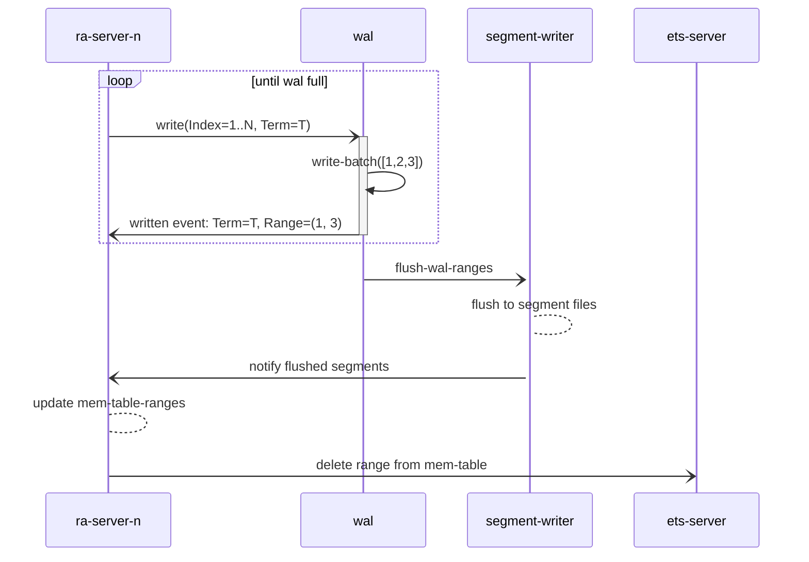

# Ra log v2 internals

In the Ra log v2 implementation some work previously done by the `ra_log_wal`
process has now been either factored out or moved elsewhere.

In Ra log v1 the WAL process would be responsible for both writing to disk and
to memtables (ETS). Each writer (identified by a locally scoped binary "UId") would
have a unique ETS table to cover the lifetime of each WAL file. Once the WAL breaches
its' configured `max_wal_size_bytes` limit it closes the file and hands it over to
the segment writer to flush any still live entries to per-server segments.
The segment writer reads each entry from the memtables, not the WAL file.
When all still live entries in the WAL have been flushed to segments the segment
writer deletes the WAL file and notifies all relevant ra servers of the new
segments. Once each ra server receives this notifications and updates their
"seg-refs" they delete the whole memtable.

In the v2 implementation the WAL no longer writes to memtables during normal
operation (exception being the recovery phase). Instead the memtables are
written to by the Ra servers before the write request is sent to the WAL.
The removes the need for a separate ETS table per Ra server "cache" which was
required in the v1 implementation.

In v2 memtables aren't deleted after segment flush. Instead they are kept until
a Ra server needs to overwrite some entries. This cannot be allowed due to the
async nature of the log implementation. E.g. the segment writer could be reading
from the memtables and if an index is overwritten it may generate an inconsistent
end result. Overwrites are typically only needed when a leader has been replaced
and have some written but uncommitted entries that another leader in a higher
term has overwritten. 

## In-Memory Tables (memtables)

Module: `ra_mt`

Mem tables are owned and created by the `ra_log_ets` process. Ra servers call
into the process to create new memtables and a registry of current tables is
kept in the `ra_log_open_memtables` table. From v2 the `ra_log_closed_memtables`
ETS table is no longer used or created.

Invariant: Entries can be written or deleted but never overwritten.

During normal operation each Ra server only writes to a single ETS memtable.
Entries that are no longer required to be kept in the memtable due to snapshotting
or having been written to disk segments are deleted. The actual delete operation
is performed by `ra_log_ets` on request by Ra servers.

Memtables are no longer linked to the lifetime of a given WAL file as before.
Apart from recovery after a system restart only the Ra servers write to
memtables which reduces the workload of the WAL process.

New memtables are only created when a server needs to overwrite indexes in its
log. This typically only happens when a leader has been replaced and steps down
to follower with uncommitted entries in its log. Due to the async nature of the
Ra log implementation it is not safe to ever overwrite an entry in a memtable
(as concurrent reads may be done by the segment writer process). Therefore a new
memtable needs to be created when this situation occurs.

When a new memtable is created the old ones will not be written to any further
and will be deleted as soon as they are emptied.

## WAL

Module: `ra_log_wal`

The `ra_log_wal` process now has the following responsibilities:

* Write entries to disk and notify the writer processes when their entries
have been synced to the underlying storage.
* Track the ranges written by each writer (ra server) for which ETS table and
notifies the segment writer when a WAL file has filled up.
* Recover memtables from WAL files after a system restart.

## Segment Writer

Module: `ra_log_segment_writer`

The segment writer's responsibilities remain much as before.
When a WAL file reaches it's max size limit the WAL will send the segment writer
a map of `#{ra_uid() => [{ets:tid(), ra_range()}]}` describing the "tid ranges"
that need to be written to disk for each `ra_uid()` (i.e. a Ra server).

The range that is actually written can be dynamically truncated if the Ra server
writes a snapshot before or during the segment flush. E.g. if the segment writer
is asked to flush the range `{1000, 2000}` and the Ra server writes a snapshot
at index 1500 the segment writer will update the range to `{1501, 2000}` to avoid flushing
redundant entries to disk.

The latest snapshot index for each Ra server is kept in the `ra_log_snapshot_state`
ETS table.

