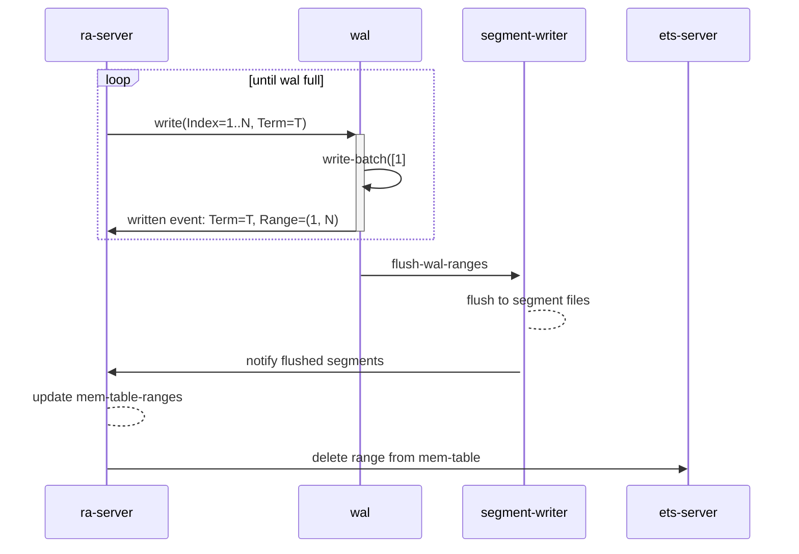

# Ra log v2 internals

In the Ra log v2 implementation some work previously done by the `ra_log_wal`
process has now been either factored out or moved elsewhere.

In v1 the WAL process would be responsible for for both writing a disk and
to mem tables. Each writer (designated by a locally scoped binary "UId") would
have a unique ETS table to cover the lifetime of each WAL file. Once the WAL has
filled and the segment writer process has flushed the mem tables to segmetn files
on disk the whole table would have been deleted.

In the v2 implementation the WAL no longer writes to memtables during normal
operation (exception being the recovery phase). Instead the mem tables are
written to by the ra servers before the write request is sent to the WAL.
The removes the need for a separate ETS table per ra server "cache" which was
required in the v1 implementation.

In v2 memtables aren't deleted after segment flush. Instead they are kept until
a Ra server needs to overwrite some entries. This cannot be allowed due to the
async nature of the log implementation. E.g. the segment writer could be reading
from the memtables and if an index is overwritten it may generate an inconsistent
end result. Overwrites are typically only needed when a leader has been replaced
and have some written but uncommitted entries that another leader in a higher
term has overwritten. 

## Memory tables (memtables)

Mem tables are owned and created by the `ra_log_ets` process. Ra servers call
into the process to create new memtables and a registry of current tables is
kept in the `ra_log_open_memtables` table. From v2 the `ra_log_closed_memtables`
ETS table is no longer used or created.
Entries can be written or deleted but never overwritten

## WAL

The `ra_log_wal` process has the following responsibilities:

* Write entries to disk and notify the writer processes when their entries
have been synced to the underlying storage.
* Track the ranges written by each writer from which ETS table and notify the
segment writer when a WAL file has filled up.
* Recover memtables from WAL files after a restart.

## Segment Writer

....

## Diagrams

```mermaid
sequenceDiagram
    participant ra-server
    participant wal
    participant segment-writer

    loop until wal full
        ra-server->>+wal: write(Index=1..N, Term=T)
        wal->>wal: write-batch([1]
        wal->>-ra-server: written event: Term=T, Range=(1, N)
    end
    wal->>+segment-writer: flush-wal-ranges
    segment-writer-->segment-writer: flush to segment files
    segment-writer->>ra-server: notify flushed segments
    ra-server-->ra-server: update mem-table-ranges
    ra-server->>ets-server: delete range from mem-table
```

